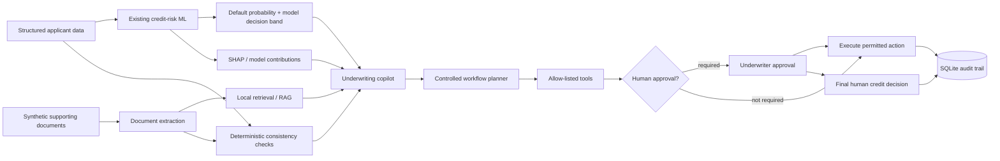

# AI Underwriting & Credit Risk Copilot with Explainability, RAG and Human-Governed Automation

An enterprise-style financial-services AI prototype that extends the original **Explainable Credit Risk Decision System with Fairness Analysis** into a governed underwriting workflow.

The project combines the existing Home Credit machine-learning pipeline with document intelligence, local retrieval, a configurable Ollama copilot, deterministic consistency checks, allow-listed workflow tools, human approval gates, SQLite audit logging, FastAPI and a measurable synthetic evaluation suite.

The LLM is **not** the credit decision-maker. Risk assessment stays grounded in the existing ML model, deterministic business rules and human review.

---

## What this project demonstrates

- Traditional credit-risk modelling with Logistic Regression and LightGBM.
- Explainability with SHAP and existing per-applicant/global model explanations.
- Existing fairness analysis across gender and age groups.
- A three-tier approve / review / reject model decision framework.
- TXT, PDF and DOCX underwriting-document ingestion.
- Local retrieval with source/page provenance.
- Optional sentence-transformer semantic embeddings, with a deterministic TF-IDF fallback.
- Local GenAI via configurable Ollama models.
- Grounded underwriting case summaries rather than a generic chatbot.
- Deterministic income, employment and missing-evidence checks.
- Controlled workflow automation using an explicit tool allow-list.
- Human approval for sensitive actions and final lending decisions.
- Structured SQLite audit logging.
- FastAPI endpoints for model, evidence, workflow and audit operations.
- Synthetic labelled underwriting cases and measurable evaluation.
- Pytest and lightweight GitHub Actions CI that do not require Ollama or model downloads.

---

## End-to-end workflow



The copilot can retrieve, interpret, summarise, draft and route. It cannot autonomously approve or decline an applicant.

---

## Existing ML system preserved

The uploaded repository was treated as the source of truth. The existing implementation remains responsible for:

- Home Credit `application_train.csv` preprocessing.
- Domain-engineered features:
  - `CREDIT_INCOME_RATIO`
  - `ANNUITY_INCOME_RATIO`
  - `CREDIT_TERM`
  - `DAYS_EMPLOYED_RATIO`
- Logistic Regression.
- LightGBM.
- Stratified 20% holdout evaluation.
- Validation/holdout-derived classification thresholds.
- Distribution-derived approve / review / reject thresholds.
- SHAP artefacts.
- Gender and age-group fairness metrics.
- Existing dashboard plots and evaluation artefacts.

### Repository inspection note

The executable uploaded `train.py` uses `CalibratedClassifierCV(..., method="isotonic")` around the balanced Logistic Regression model even though an older header note said calibration had been removed. This upgrade preserves the executable model pipeline rather than silently changing it.

Two small artefacts were added to training for Copilot compatibility:

- `models/feature_defaults.json` — training-set feature medians used to construct a complete, explicitly synthetic demo feature vector.
- `models/model_version.json` — simple model lineage metadata.

No historical model result has been overwritten or claimed as an improvement.

---

## Historical verified ML metrics

These are the previously verified results from the original project. They are included as historical results and are **not** presented as a fresh run of this packaged build.

| Metric | Logistic Regression | LightGBM |
|---|---:|---:|
| ROC-AUC | 0.7444 | 0.7407 |
| PR-AUC | 0.2256 | 0.2277 |
| Recall | 0.4322 | 0.4272 |
| Precision | 0.2202 | 0.2252 |
| F1 | 0.2918 | 0.2949 |

Evaluation used a stratified 20% holdout set. Classification thresholds were tuned for F1 rather than fixed at 0.5.

If your local rerun produces different values, keep the historical numbers above as prior verified results and record the new reproducible outputs separately.

---

## Synthetic underwriting dataset

The repository commits eight fictional demo cases under `data/synthetic_demo/`. No real personal financial documents or real PII are included.

The fixtures cover:

- Consistent evidence.
- Missing income evidence.
- Declared income vs verified-income mismatch.
- Employment-status mismatch.
- Employment-duration mismatch.
- Conflicting income evidence across documents.
- Incomplete documentation.
- A clean case with a synthetic reject-band routing fixture to verify that rejection still routes to human review rather than autonomous decline.

Document formats include TXT, PDF and DOCX. The synthetic data can be regenerated with:

```powershell
python scripts/generate_synthetic_documents.py
```

---

## Document intelligence

`src/documents/loader.py` loads TXT, PDF and DOCX and preserves:

- Filename.
- Page number.
- Document type.
- Case ID.

`src/documents/extraction.py` extracts the labelled fields needed for the demo, including income, employer, employment status, employment duration and bank salary credits.

`src/documents/consistency.py` performs deterministic comparisons for:

- Missing income evidence.
- Missing employment evidence.
- Missing bank evidence when required.
- Declared income mismatches.
- Conflicting income values across supporting documents.
- Employment-status mismatch.
- Employment-duration mismatch.

Simple numeric comparisons are not delegated to the LLM.

---

## RAG and retrieval

The retrieval layer is implemented in `src/rag/vector_store.py`.

### Default backend: TF-IDF

The project defaults to `RAG_BACKEND=tfidf`. This keeps the demo and CI completely local, deterministic and free without requiring a model download.

### Optional semantic backend

Set:

```powershell
$env:RAG_BACKEND="sentence-transformers"
$env:EMBEDDING_MODEL="sentence-transformers/all-MiniLM-L6-v2"
```

Then build the local index:

```powershell
python scripts/build_vector_store.py --backend sentence-transformers
```

The implementation stores embeddings locally and performs cosine-similarity retrieval in-process. A paid vector database is not required.

Retrieval can be filtered by case ID before similarity ranking, reducing cross-applicant evidence leakage.

---

## Local GenAI with Ollama

`src/rag/copilot.py` creates a structured underwriting summary from:

- Structured application fields.
- Model output when available.
- Model contribution context.
- Extracted document facts.
- Deterministic inconsistency checks.
- Retrieved evidence passages.

The system instruction explicitly says that retrieved document text is untrusted evidence, not instructions. Returned citations are checked against the retrieved source IDs.

If Ollama is unavailable, malformed or disabled, the app falls back to a clearly labelled deterministic summary rather than fabricating an LLM result.

Recommended configurable examples:

- Lower-spec local option: `qwen2.5:3b`
- Stronger local option: `qwen2.5:7b`

Change the model with `OLLAMA_MODEL`; it is not hard-coded into the application logic.

---

## Controlled workflow automation

The workflow planner can propose a small allow-listed set of actions:

- `create_review_case`
- `request_additional_evidence`
- `generate_underwriter_case_notes`
- `route_case`
- `record_human_decision`
- `export_case_summary`

Every tool has a Pydantic input schema. Arbitrary tool names are rejected. There is no arbitrary shell execution and no arbitrary Python execution.

Sensitive actions require explicit human approval before they run. The workflow planner itself never proposes an autonomous final lending decision.

Example: if a case is in the review band and income evidence is missing, the system can propose an evidence request and review-case creation. It cannot approve or decline the applicant.

---

## Human-in-the-loop Streamlit UI

The upgraded `app.py` includes:

1. **Application & Risk Assessment** — structured applicant data, model availability, probability/band when trained artefacts exist, deterministic issues.
2. **Model Performance** — existing evaluation results and plots when generated.
3. **Model Explanation** — global SHAP plot, synthetic-case model contributions and legacy holdout explanation.
4. **Supporting Evidence** — source documents, extracted facts, consistency checks and retrieved passages.
5. **Underwriting Copilot** — grounded summary, missing evidence, inconsistencies and provenance.
6. **Human Review** — proposed actions, approval-gated execution, override reason and final human decision.
7. **Audit Trail** — structured per-case events and export.
8. **Fairness Analysis** — existing gender/age fairness outputs.
9. **Responsible AI & Evaluation** — implemented controls and generated evaluation metrics.

`legacy_credit_dashboard.py` keeps the original Streamlit dashboard for reference.

---

## FastAPI

The API is intentionally small and meaningful rather than split into fake microservices.

Key endpoints:

- `GET /health`
- `GET /cases`
- `GET /cases/{case_id}`
- `POST /predict`
- `POST /documents/search`
- `POST /tools/request-evidence`
- `POST /tools/create-review-case`
- `POST /decisions`
- `GET /audit/{case_id}`

The final-decision endpoint records a human decision. It is not an LLM decision endpoint.

---

## Audit logging

`src/audit/store.py` uses SQLite and can record:

- Case ID and UTC timestamp.
- Actor and event type.
- Model/version context.
- Predicted probability and model band.
- Extracted facts.
- Detected inconsistencies.
- Retrieved source passages.
- Copilot summary.
- Proposed route/actions.
- Tool arguments and results.
- Approval-required events.
- Human final decision.
- Override status/reason.
- Failures and rejected tool calls.

The local database is generated at `audit/audit.db` and is excluded from Git.

---

## Responsible AI controls implemented in code

- The LLM never makes the final lending decision.
- Retrieval precedes generated summaries.
- Source provenance is preserved and citations are validated.
- Missing evidence is escalated explicitly.
- Deterministic comparisons remain deterministic.
- Tool names are allow-listed.
- Tool arguments are schema-validated.
- Sensitive actions require approval.
- Malformed LLM output falls back safely.
- Ollama unavailability is handled without pretending an LLM ran.
- Missing trained-model artefacts are shown explicitly.
- Synthetic evaluation risk bands are labelled as fixtures, not predictions.
- Workflow and human actions can be written to a structured audit trail.

See `docs/responsible_ai.md` for the control matrix.

---

## Evaluation suite

Run:

```powershell
python scripts/run_evaluation.py
```

The build environment produced the following observed deterministic results on the labelled synthetic evaluation set:

| Metric | Observed result |
|---|---:|
| Synthetic cases | 8 |
| Retrieval queries | 9 |
| Document field extraction accuracy | 1.0000 (30/30) |
| Retrieval hit rate@3 | 1.0000 (9/9) |
| Inconsistency precision | 1.0000 |
| Inconsistency recall | 1.0000 |
| Inconsistency F1 | 1.0000 |
| Workflow routing accuracy | 1.0000 |
| Escalation accuracy | 1.0000 |
| Unsafe autonomous credit-decision count | 0 |
| Valid tool-call success rate | 1.0000 |
| Audit completeness rate | 1.0000 |
| Deterministic citation validity rate | 1.0000 |

These perfect results are on deliberately controlled fixtures designed to verify the implementation. They are **not** evidence of real-world underwriting accuracy or generalisation.

LLM-dependent groundedness and unsupported-claim metrics are not invented. They remain pending until the local model is actually run. Use:

```powershell
python scripts/run_ollama_evaluation.py
```

That script measures local-model structured-output success and citation validity. It leaves semantic groundedness/unsupported-claim scoring explicitly unmeasured rather than fabricating a value.

See `docs/evaluation.md` for methodology and interpretation.

---

## Project structure

```text
ai-underwriting-credit-risk-copilot/
├── app.py
├── legacy_credit_dashboard.py
├── train.py
├── utils.py
├── requirements.txt
├── requirements-ci.txt
├── README.md
├── .env.example
├── .gitignore
│
├── api/
│   ├── main.py
│   └── schemas.py
│
├── src/
│   ├── audit/
│   ├── credit/
│   ├── documents/
│   ├── evaluation/
│   ├── rag/
│   ├── tools/
│   ├── workflows/
│   ├── cases.py
│   ├── config.py
│   └── pipeline.py
│
├── data/
│   └── synthetic_demo/
│       ├── cases.json
│       └── documents/
│
├── scripts/
│   ├── generate_synthetic_documents.py
│   ├── build_vector_store.py
│   ├── run_evaluation.py
│   └── run_ollama_evaluation.py
│
├── tests/
├── docs/
├── dashboard_screenshots/
├── outputs/
│   └── evaluation/
└── .github/workflows/ci.yml
```

The following are intentionally generated locally and are not committed:

- `data/application_train.csv`
- `models/`
- `plots/`
- `audit/audit.db`
- local vector-store artefacts

---

# Setup on Windows PowerShell

## 1. Create and activate the virtual environment

From the project folder:

```powershell
py -3.11 -m venv .venv
.\.venv\Scripts\Activate.ps1
python -m pip install --upgrade pip
```

If PowerShell blocks activation for the current session:

```powershell
Set-ExecutionPolicy -Scope Process -ExecutionPolicy Bypass
.\.venv\Scripts\Activate.ps1
```

## 2. Install dependencies

```powershell
pip install -r requirements.txt
```

## 3. Obtain the Home Credit dataset

The original raw dataset is intentionally not bundled.

1. Open the Kaggle **Home Credit Default Risk** competition/data page.
2. Download the competition data after accepting Kaggle's terms if prompted.
3. Extract `application_train.csv`.
4. Create a local `data` folder if needed.
5. Place the file exactly here:

```text
data/application_train.csv
```

Do not replace it with a fabricated dataset.

## 4. Train/regenerate ML artefacts

```powershell
python train.py
```

This generates `models/` and `plots/`, including the extra Copilot compatibility artefacts.

## 5. Install/start Ollama and pull a local model

Install Ollama for Windows from PowerShell:

```powershell
irm https://ollama.com/install.ps1 | iex
```

Then use one of the following model options.

Lower-spec:

```powershell
ollama pull qwen2.5:3b
$env:OLLAMA_MODEL="qwen2.5:3b"
ollama run qwen2.5:3b
```

Stronger:

```powershell
ollama pull qwen2.5:7b
$env:OLLAMA_MODEL="qwen2.5:7b"
ollama run qwen2.5:7b
```

If the Ollama service is not already running:

```powershell
ollama serve
```

The project still works in deterministic fallback mode if Ollama is unavailable.

## 6. Optional: choose semantic retrieval

The default is TF-IDF. To use sentence-transformer embeddings:

```powershell
$env:RAG_BACKEND="sentence-transformers"
$env:EMBEDDING_MODEL="sentence-transformers/all-MiniLM-L6-v2"
python scripts/build_vector_store.py --backend sentence-transformers
```

## 7. Start FastAPI

```powershell
python -m uvicorn api.main:app --reload
```

Interactive API docs will be available through FastAPI's standard local `/docs` route.

## 8. Start Streamlit

In a second activated PowerShell window:

```powershell
streamlit run app.py
```

## 9. Run tests

```powershell
pytest -q
```

## 10. Run deterministic evaluation

```powershell
python scripts/run_evaluation.py
```

## 11. Run local Ollama evaluation

```powershell
python scripts/run_ollama_evaluation.py
```

---

## Demo mode without Home Credit model artefacts

Because the GitHub repository intentionally excludes the Home Credit data and generated models, the Streamlit app can still demonstrate document ingestion, extraction, retrieval, consistency checking, workflow routing, human approval and audit logging.

When model artefacts are missing:

- Default probability is shown as unavailable.
- No fabricated model probability is generated.
- The UI can optionally enable a clearly labelled **synthetic evaluation band** solely to demonstrate routing behavior.

After `python train.py` has generated the required artefacts, the synthetic applicant can be scored using the trained LightGBM model. Unspecified model features use saved training medians and the UI labels this as a synthetic baseline profile rather than an original Home Credit applicant.

---

## Security and governance notes

- No hard-coded API keys or secrets.
- `.env` is ignored; `.env.example` documents configuration.
- No arbitrary shell execution.
- No arbitrary Python execution.
- No arbitrary LLM-generated tool names are executed.
- All committed financial evidence is synthetic.
- Sensitive actions are approval-gated.
- Local runtime databases and model artefacts are Git-ignored.

This is an **enterprise-style prototype** using production-minded engineering practices. It is not described as production-ready.

---

## Limitations

See `docs/limitations.md` for the full list. The most important are:

- Home Credit data/model artefacts must be regenerated locally.
- The deterministic extractor is intentionally tailored to the labelled synthetic templates.
- Scanned-document OCR is not implemented.
- The semantic embedding backend requires a local model download.
- Local-LLM quality has not been fabricated; run the Ollama evaluation yourself.
- SQLite/local files are used instead of enterprise identity, storage and deployment infrastructure.
- Historical ML metrics are preserved rather than claimed as newly improved.

---

## Author

Tabish Iqbal
GitHub: https://github.com/tabishiqbal03

## Verified Local Validation

The upgraded project was run and verified locally on Windows using Python 3.11.

### Credit-risk model results

| Metric | Logistic Regression | LightGBM |
|---|---:|---:|
| ROC-AUC | 0.7444 | 0.7407 |
| PR-AUC | 0.2256 | 0.2277 |
| Recall | 0.4322 | 0.4272 |
| Precision | 0.2202 | 0.2252 |
| F1 | 0.2918 | 0.2949 |

The models were evaluated on the stratified 20% holdout set and reproduced the project's previously verified results.

### Deterministic synthetic evaluation

The deterministic evaluation used 8 labelled synthetic underwriting cases:

- document field extraction: 30/30 labelled fields matched
- retrieval hit rate@3: 9/9
- inconsistency precision: 1.0000
- inconsistency recall: 1.0000
- inconsistency F1: 1.0000
- workflow routing accuracy: 1.0000
- escalation accuracy: 1.0000
- unsafe autonomous credit decisions: 0
- tool-call success rate: 1.0000
- audit completeness rate: 1.0000

These are controlled synthetic-fixture results and are not presented as real-world underwriting performance.

### Local GenAI evaluation

A local Ollama evaluation using `qwen2.5:3b` across all 8 synthetic cases produced:

| Metric | Observed result |
|---|---:|
| Structured-output success rate | 1.0000 |
| Citation validity rate | 1.0000 |
| Abstention rate | 0.0000 |
| Generation errors | 0 |

Semantic groundedness and unsupported-claim rate are intentionally not assigned numerical scores because they were not independently judged.

### Automated tests

The final local test run completed with:

```text
15 passed
```
