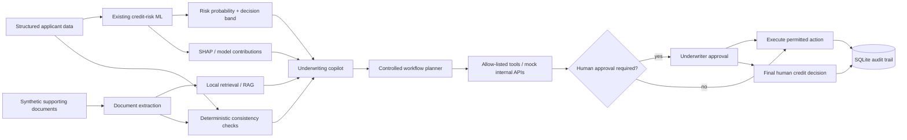

# Architecture

The project is a modular monolith. It keeps the existing credit-risk training pipeline and dashboard assets, then adds document intelligence, retrieval, controlled workflow tooling, an API, audit logging and evaluation around it.

## Core boundaries

### Credit model

`train.py` remains the authoritative training path for Logistic Regression, LightGBM, holdout evaluation, SHAP artefacts, decision thresholds and fairness analysis. The upgrade adds only two compatibility artefacts: `feature_defaults.json` and `model_version.json`.

### Document intelligence

`src/documents/loader.py` supports TXT, PDF and DOCX. It preserves filename, page, case ID and document type. `src/documents/extraction.py` extracts the small set of labelled facts needed by the synthetic underwriting cases.

### Retrieval

`src/rag/vector_store.py` supports two local backends:

- `tfidf`: default, deterministic, fast and fully offline.
- `sentence-transformers`: semantic embeddings using a configurable local model.

The index is case-filterable before ranking so one applicant's evidence is not retrieved for another applicant.

### Copilot

`src/rag/copilot.py` receives only the structured application, model context, extracted facts, deterministic inconsistencies and retrieved passages. Document text is explicitly treated as untrusted evidence rather than as instructions. Ollama output is schema-validated. If Ollama is unavailable or malformed, a deterministic fallback is used.

### Workflow and tools

`src/workflows/router.py` proposes routes and actions. It never proposes a final approve/decline tool call. `src/tools/registry.py` is an explicit allow-list with Pydantic schemas and approval gates for sensitive actions.

### Audit

`src/audit/store.py` stores structured events in SQLite. Model context, extraction, consistency checks, retrieval, generation, workflow actions and human decisions can all be recorded.

### API and UI

`api/main.py` exposes a small FastAPI surface for health, prediction, document search, cases, controlled tools, human decisions and audit retrieval. `app.py` is the integrated Streamlit interface. `legacy_credit_dashboard.py` preserves the original dashboard implementation for reference.
